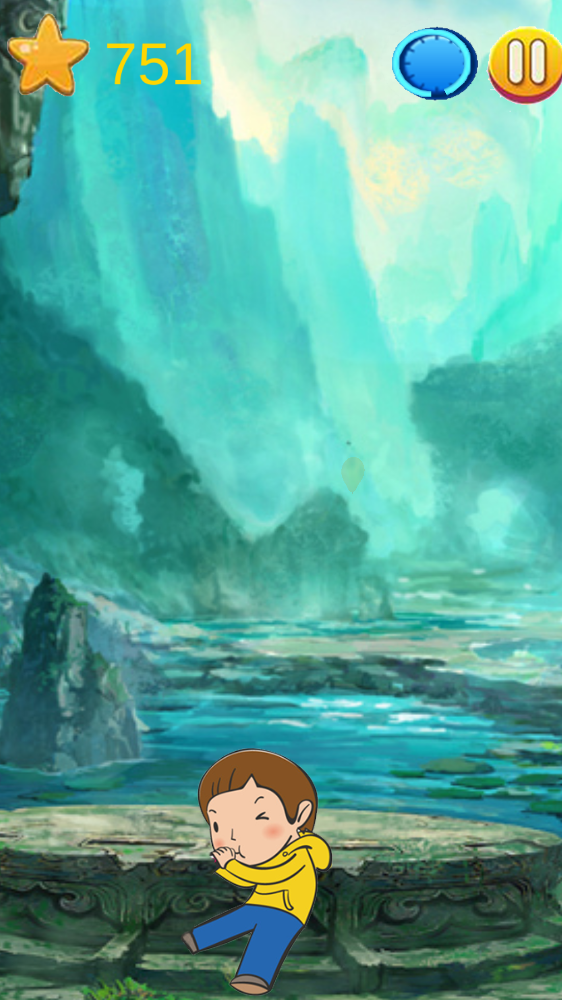
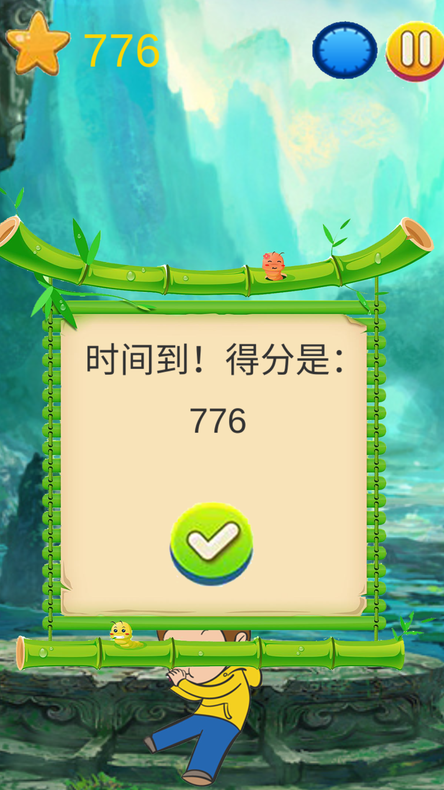
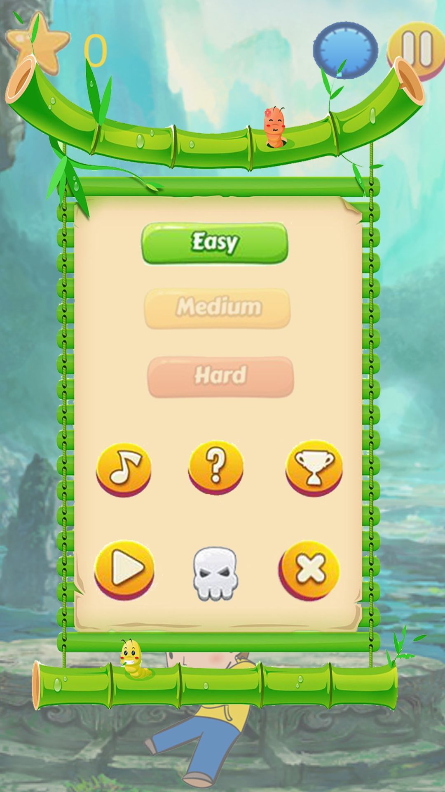
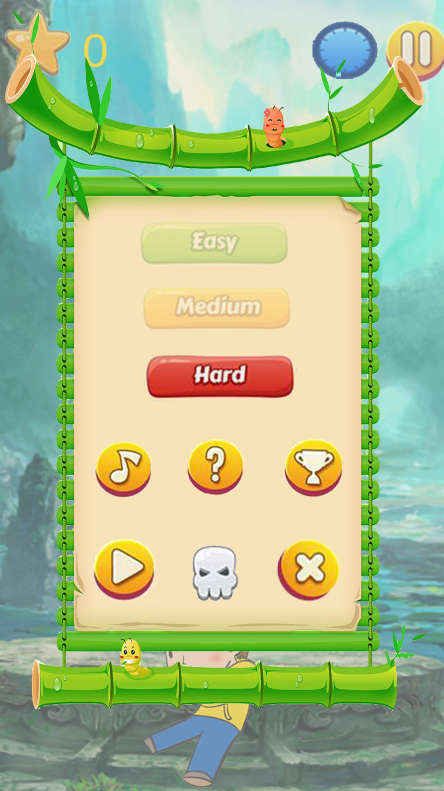
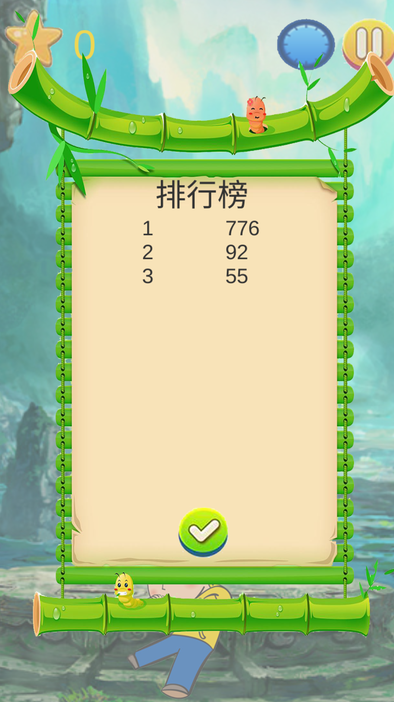
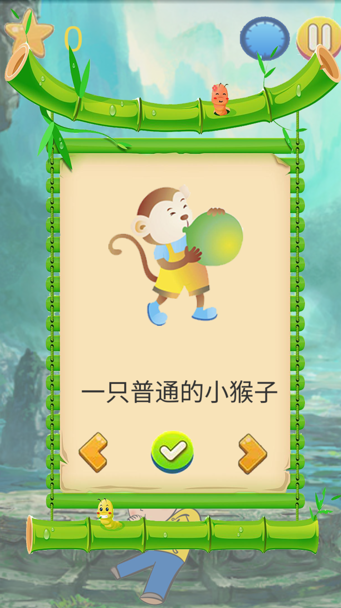
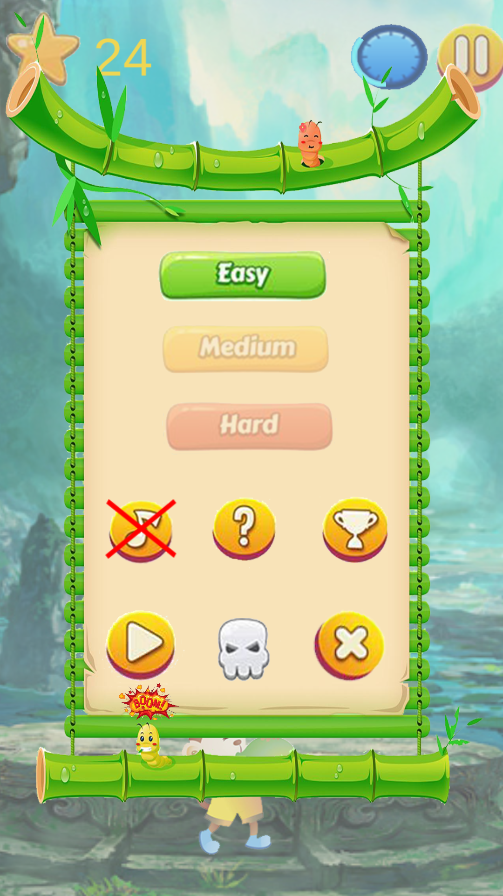

### Balloon 报告

Balloon编译至安卓平台，安装包见根目录下Build内。

最终完成了最初策划案中的部分重要功能：如游戏核心玩法，得分结算，本地排行，角色切换，难度切换等。

以下为在安卓端的测试截图：

连续点击屏幕吹气球，可以使气球体积变大。气球变大的速度随气球体积增大而变快。停止点击一段时间后，代表松开气球，气球远离渐渐消失。气球越大，左上方的得分越高。右上方时间进度填满后游戏结束，系统会记录分数，存入本地的排行榜。右上方黄色按钮为暂停键，暂停后弹出菜单。

上图为默认情况下选择简单模式，点击难度模式选项可以修改。下图为切换成困难模式。

菜单中的奖杯按钮为本地排行榜，高分会存放在本地文件。菜单中的问号按钮为帮助信息。

菜单中的骷髅按钮为切换人物，点击左右切换，绿色按钮选中人物。下图为切换成小猴子的结果。

菜单中的音符按钮为静音选项，选中后可关闭游戏声音。

想要继续游戏可以点击最下方左侧播放按钮。最右侧叉形按钮为退出游戏。

以上就是整个气球游戏的介绍。主要工作在完成游戏主体逻辑及设计绘制游戏UI。

不足之处：UI使用UGUI制作，限于时间未进行自适应适配。对比最初的策划案，不同人物的数值差异和道具功能未实现。由于是直接使用PS对图片进行处理，整体不太美观，应该选用更美观的UI插件或场景资源。